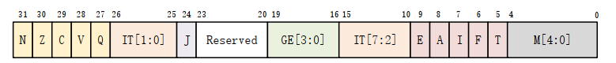

# *arm体系结构*

## arm架构和处理器
    1. 32位精简指令集RISC
    2. 寄存器。
    3. ARM汇编。
    4. Caches(缓存架构)。
    5. MMU（内存管理单元）。
    6. 哈佛结构。
     
## 相关术语
    
    1. 流水线F->D->E: 取指令->译码->执行。
    2. DSP: 数字信号处理。
    3. Jazelle： 针对java的编程指令
    4. Thumb: 16位指令集。
    5. ThumbEE: thumb2指令集，16位，32位混合指令集。
    6. TrustZone:  安全架构。
    7. VFP: 矢量浮点运算。
    8. SIMD/NEON/LPAE。
    9. Virtualization 虚拟技术。
    10.big.LITTLE:  大小核技术。       

## arm相关工具
    1. addr2line: 把程序地址转换为文件名和行号。
    2. ar: 建立，修改，提取归档文件。 
    3. as: 主要用来编译GNU C编译器gcc输出的汇编文件。
    4. ld: GNU链接器。
    5. nm: 列出目标文件的符号。
    6. objcopy: 文件格式装换。
    7. objdump: 显示一个或者更多目标文件的信息，主要用来反汇编。
    8. ranlib: 产生归档文件索引，并将其保存到这个归档文件中。
    9. readelf: 显示elf格式可执行文件的信息。
    10. size:  列出目标文件每一段的大小以及总体的大小。
    11. strings: 打印某个文件的可打印字符串。
    12. strip: 丢弃目标文件中的全部或者特点符号，减小文件体积。

## CPU结构
    1. ALU：算术逻辑单元
    2. 控制单元。
    3. 寄存器。
    4. 数据总线。  

## 处理器模式

ARM架构有9种处理器模式，8种特权模式，1种非特权模式即用户模式。

|模式名称 |编码      |功能 |
|:---    |:---      |:--- |
|User(USR)    |10000     |大部分程序运行时候的非特权模式|
|FIQ     |10001     |进入FIQ(快速中断)中断异常|
|IRQ     |10010     |进入IRQ中断异常|
|Supervisor(SVC) |10011|管理调用指令被执行或者reset的时候|
|Monitor(MON)|10110|安全扩展模式，只用于安全|
|Abort(ABT)|10111|存储异常访问|
|Hyp(HYP)|11010|虚拟化扩展|
|Undef(UND)|11011|未定义的指令执行的时候|
|System(SYS)|11111|特权模式，与用户模式共享寄存器|

## 寄存器
R0-R12: 32位通用寄存器。
R13: sp寄存器，栈指针,储存栈地址。
R14: lr寄存器，链接寄存器，储存子程序返回地址。
R15: pc寄存器，程序计数器。
APSR/CPSR: 应用程序状态寄存器/当前程序状态寄存器。
SPSR: 已存储程序状态寄存器。

|模式|共享寄存器|独享寄存器|
|---|---|---|
|User|R0-R15、APSR||
|FIQ|R0-R7、R16、CPSR|R8-R14、SPSR|
|IRQ|R0-R12、R15、CPSR|R13-R14、SPSR|
|ABT|R0-R12、R15、CPSR|R13-R14、SPSR|
|SVC|R0-R12、R15、CPSR|R13-R14、SPSR|
|UND|R0-R12、R15、CPSR|R13-R14、SPSR|
|MON|R0-R12、R15、CPSR|R13-R14、SPSR|
|HYP|R0-R12、R14-R15、CPSR|R13、SPSR|

总结：
1. R0-R12 为32位通用寄存器，存放通用数据。
2. 各个模式的R0-R12与User模式共享（除了FIQ, R8-R12), PC, CPSR共享的。
3. User模式没有SPSR。
4. thumb指令集 只能访问R0-R7,不能访问R8-R12。

CPSR 指令格式：

N(bit31)：当两个补码表示的 有符号整数运算的时候， N=1 表示运算对的结果为负数， N=0表示结果为正数。

Z(bit30)： Z=1 表示运算结果为零， Z=0 表示运算结果不为零，对于 CMP 指令， Z=1 表示进行比较的两个数大小相等。

C(bit29)：在加法指令中，当结果产生了进位，则 C=1，表示无符号数运算发生上溢，其它情况下 C=0。在减法指令中，当运算中发生借位，则 C=0，表示无符号数运算发生下溢，其它情况下 C=1。对于包含移位操作的非加/减法运算指令， C 中包含最后一次溢出的位的数值，对于其它非加/减运算指令， C 位的值通常不受影响。

V(bit28)： 对于加/减法运算指令，当操作数和运算结果表示为二进制的补码表示的带符号数时， V=1 表示符号位溢出，通常其他位不影响 V 位。
Q(bit27)： 仅 ARM v5TE_J 架构支持，表示饱和状态， Q=1 表示累积饱和， Q=0 表示累积不饱和。

IT1:0： 和 IT7:2一起组成 IT[7:0]，作为 IF-THEN 指令执行状态。
J(bit24)： 仅 ARM_v5TE-J 架构支持， J=1 表示处于 Jazelle 状态，此位通常和 T(bit5)位一起表示当前所使用的指令集，00-ARM，01-Thumb，11-ThumbEE，10-Jazelle

GE3:0： SIMD 指令有效，大于或等于。

IT7:2： 参考 IT[1:0]。

E(bit9)： 大小端控制位， E=1 表示大端模式， E=0 表示小端模式。

A(bit8)： 禁止异步中断位， A=1 表示禁止异步中断。

I(bit7)： I=1 禁止 IRQ， I=0 使能 IRQ。

F(bit6)： F=1 禁止 FIQ， F=0 使能 FIQ。

T(bit5)： 控制指令执行状态，表明本指令是 ARM 指令还是 Thumb 指令，通常和 J(bit24)一起表明指令类型，参考 J(bit24)位。

M[4:0]： 处理器模式控制位。

## 指令执行过程
* 指令预读取（决定从内存哪儿取指令）。
* 指令读取（从内存系统中读取指令）。
* 指令译码（解读指令并且生成控制信号）。
* 寄存器读取（提供寄存器的值给操作单元）。
* 分配（分配指令给执行单元）。
* 执行（实际的ALU单元处理）。
* 内存访问（数据的存取）。
* 寄存器回写（更新运行结果到寄存器）。