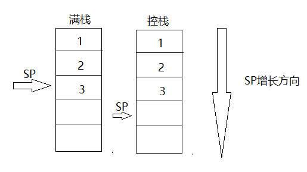

# *指令详解(一)*

## 储存访问指令
&emsp;&emsp;ARM指令集属于RISC指令集，RISC处理器采用典型的加载/存储体系结构，CPU无法对内存里的数据直接操作，只能通过Load/Store指令来实现。

    LDR R1, [R0]        ;将R0中的值作为地址，将该地址上的数据保存到R1
    STR R1, [R0]        ;将R0中的值作为地址，将R1中的值保存到这个地址上
    LDRB/STRB           ;读写一个字节，LDR/STR每次读写4个字节
    SWP R1, R1, [R0]    ;将R1与R0中地址所指向的内存单元中的数据交换
    SWP R1, R2, [R0]    ;将[R0]存储到R1，将R2写入到[R0]这个内存单元

&emsp;&emsp;不同类型的堆栈
|堆栈格式|备注|
|---|---|
|FA|满递增堆栈|
|FD|满递减堆栈|
|EA|空递增堆栈|
|ED|空递减堆栈|

&emsp;&emsp;如下图所示，在一个堆栈内存结构中，如果堆栈指针SP总是指向栈顶元素，则为满栈；如果堆栈指针SP总是指向栈顶元素的下一个空闲的存储单元，则为空栈。

&emsp;&emsp;每入栈一个元素,栈指针SP都会往栈增长的方向移动一个存储单元。如果栈指针SP从高地址往地址移动，则为递减栈；如果栈指针SP从低地址往高地址移动，则为递增栈。ARM处理器一般都是满递减堆栈，在将一组寄存器入栈，或者从栈中弹出一组寄存器时，可用如下指令。

    LDMFD SP!, {R0-R2, R14}     ;将内存栈中的数据依次弹出到R14、R2、R1、R0
    STMFD SP!, {R0-R2, R14}     ;将R0、R1、R2、R14依次压入内存栈

&emsp;&emsp;注意栈先入后出的特点。
&emsp;&emsp;ARM还提供了PUSH和POP指令来执行栈元素的入栈和出栈操作。

    PUSH {R0-R2, R14}       ;将R0、R1、R2、R14依次压入内存栈
    POP  {R0-R2, R14}       ;将内存栈中的数据依次弹出到R14、R2、R1、R0

## 数据传送指令
&emsp;&emsp;MOV指令用寄存器之间传送数据。指令格式如下。
    
    MOV {cond} {S} Rd, operand2
    MVN {cond} {S} Rd, operand2

&emsp;&emsp;{cond}为条件指令可选项，{S}用来表示是否影响CPSR寄存器的值，如MOVS指令就会影响寄存器CPSR的值，而MOV则不会。MVN指令用将操作数operand2按位取反后传送目标寄存器Rd，操作数operand2可以是一个立即数，也可以是一个寄存器。

    MOV R1, #1          ;将立即数1传送到寄存器R1中
    MOV R1, R0          ;将寄存器R0的值传送到寄存器R1中
    MOV PC, LR          ;子程序返回
    MVN R0, #0xFF       ;将立即数0xFF取反后赋值刚给R0
    MVN R0, R1          ;将R1寄存器的值取反后赋值给R0     